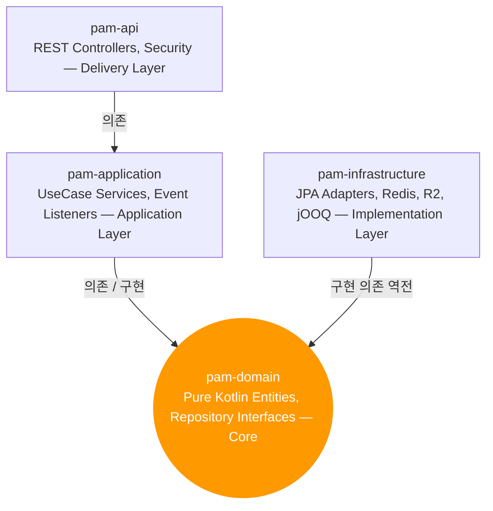

## 왜 Clean Architecture인가

Pet-Pass 코드를 다시 들여다본 적이 있다. API 라우트 안에 DB 쿼리가 직접 들어 있었다. 데이터 가공 로직이 여러 파일에 중복으로 흩어져 있었다. 기능이 생길 때마다 파일 하나씩 추가한 결과였다.

나쁜 방법은 아니었다. 빠르게 돌아갔고, 처음엔 AI가 코드를 추가하는 것도 편했다. 문제는 수정할 때 생겼다. 뭔가를 바꾸면 예상치 못한 다른 곳이 터졌다. AI도 어디를 고쳐야 할지 문맥을 잃기 시작했다. 코드가 쌓이는 건 눈에 보이지만, 구조가 무너지는 건 다 쌓이고 나서야 보인다.

피카밈은 Pet-Pass보다 훨씬 복잡하다. 하트 시스템, 가챠 로직, 소셜 로그인, 동시 요청 처리. 이걸 다 한 곳에 쑤셔 넣으면 Pet-Pass보다 훨씬 빠르게 혼돈이 온다. 그래서 처음부터 Clean Architecture로 시작했다.

> [!NOTE]
> 코드 스타일은 나중에 맞출 수 있다. 구조는 한 번 무너지면 되돌리기 어렵다.

## 4계층으로 나누는 방법

Gradle 멀티 모듈로 4개 계층을 물리적으로 분리했다. 의존성 방향이 핵심이다. 바깥이 안쪽을 의존하고, 안쪽은 바깥을 모른다.


*(Domain은 아무것도 모른다. Infrastructure는 Domain을 구현할 뿐이다.)*

핵심은 `pam-domain`이다. 이 모듈에는 순수 Kotlin 객체만 들어간다. JPA 어노테이션 없음, Spring 의존 없음. 도메인 로직을 DB나 프레임워크 없이 단위 테스트할 수 있다.

```kotlin
// pam-domain — 순수 Kotlin. @Entity 없음.
data class User(
    val id: UserId,
    val nickname: String,
    val provider: OAuthProvider
) {
    fun validate() {
        require(nickname.isNotBlank()) { "닉네임은 비어있을 수 없다" }
    }
}
```

## AI는 계층을 모른다

구조를 설계하는 것보다 AI가 그 구조를 지키게 하는 게 더 어려웠다. 이게 진짜 이슈였다.

AI는 동작하는 코드를 빠르게 만드는 데 최적화되어 있다. 계층이 있다는 걸 알아도, 가장 빠른 방법으로 문제를 풀려다 보면 레이어 경계를 넘어버린다. 의도가 아니라 최적화의 부작용이다.

*   **시도 1 · 실패**: AI가 domain 엔티티에 `@Entity`, `@Column`을 달기 시작했다. Infrastructure에 있어야 할 JPA 매핑 로직이 domain으로 올라왔다. 코드는 돌아갔지만 계층 분리의 의미가 사라졌다.
*   **시도 2 · 부분 성공**: 계층 규칙을 프롬프트에 명시했다. AI가 지키려 했지만 application에서 JPA Repository를 직접 주입하는 경우가 생겼다. domain Interface를 거쳐야 하는 흐름을 놓쳤다. 세션이 길어질수록 규칙을 잊어버렸다.
*   **시도 3 · 부분 성공**: 매 세션 시작마다 규칙을 다시 설명했다. 지켜지긴 했지만 너무 번거로웠다. AI가 컨텍스트를 잃을 때마다 같은 설명을 반복해야 했다.
*   **해결 · AIRULES.md**: 프로젝트 루트에 `AIRULES.md`를 만들었다. 계층 의존성 방향, 금지 사항, 도메인 순수성 규칙을 한 문서에 정리했다. AI가 세션마다 이 파일을 참조한다. 규칙이 코드 밖에 문서로 고정되니 일관성이 생겼다.

AIRULES.md가 효과적인 이유는 단순하다. AI의 단기 기억은 세션 단위로 리셋된다. 하지만 파일은 리셋되지 않는다. 설계 의도를 코드가 아니라 문서로 고정하면, AI가 새 세션에서도 같은 구조 위에서 작업할 수 있다.

## 실제로 어떻게 됐나

초반 세팅에 시간이 꽤 걸렸다. 모듈 간 의존성 설정, Flyway DB 형상 관리, GlobalExceptionHandler, 공통 응답 규격 — 기능 코드를 한 줄도 안 짰는데 작업 티켓이 이미 쌓여 있었다.

하지만 그 이후가 달랐다. 하트 시스템을 추가할 때, 밈 생성 로직을 붙일 때 — "이건 Domain에", "이건 Infrastructure에"가 자연스럽게 결정됐다. AI도 구조를 파악하고 나니까 헷갈리지 않았다.

Pet-Pass에서는 뭔가를 바꾸면 예상치 못한 곳이 터졌다. 피카밈에서는 그런 일이 거의 없었다. 구조가 잡혀 있으면 AI도 안전하게 작업한다.

---

> [!IMPORTANT]
> **이 경험에서 배운 것**
> AI에게 코드 스타일보다 구조 규칙을 먼저 가르쳐야 한다. AI는 코드를 빠르게 짜지만, 구조는 직접 지정해줘야 지킨다. 그 지정을 프롬프트가 아니라 파일로 해야 세션이 바뀌어도 유지된다.
>
> Clean Architecture의 진짜 가치는 테스트 가능성이나 교체 용이성보다, 적어도 지금 이 단계에서는 — 변경이 퍼지지 않는다는 것이다. 어디를 고쳐야 할지 안다는 것만으로도 충분히 가치가 있다.
